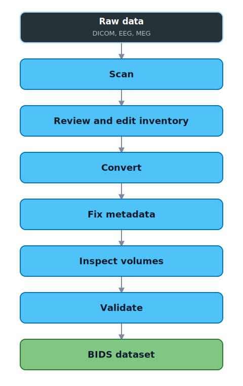
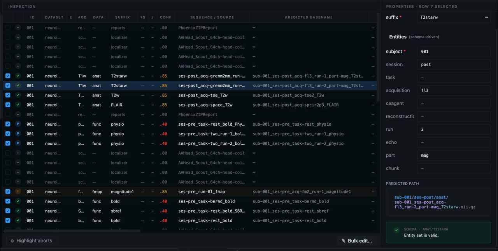
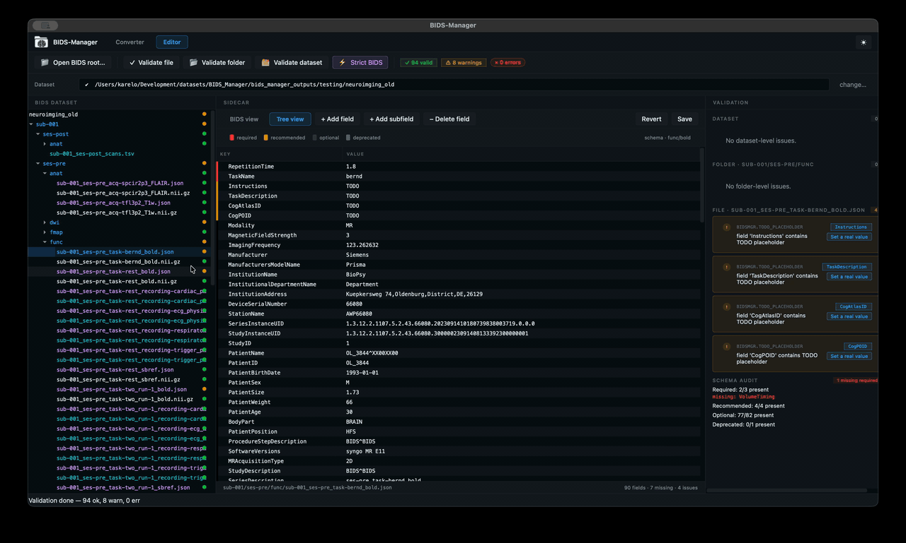
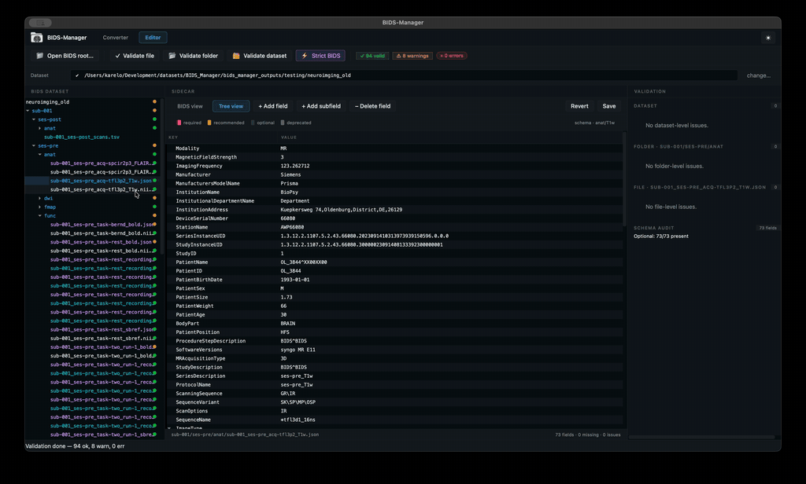
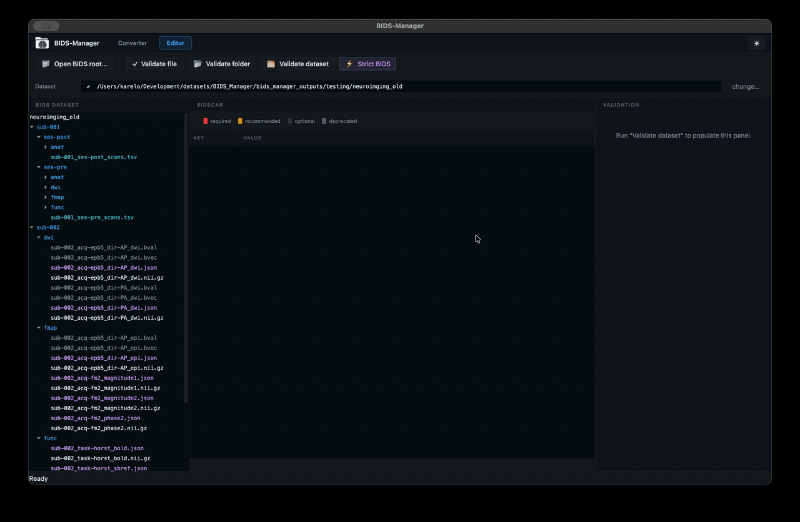

<h1 align="center">
  <br>
  <!-- Here, insert the wordmark image. Use bidsmgr/gui/assets/wordmark.png,
       transparent background, around 480 px wide. -->
  
  <br>
</h1>

<h3 align="center">Making raw-to-BIDS less painful.</h3>

<p align="center">
  <a href="https://pypi.org/project/bids-manager/"></a>
  <a href="https://pypi.org/project/bids-manager/"></a>
  <a href="LICENSE"></a>
  <a href="https://ancplaboldenburg.github.io/bids_manager_documentation/"></a>
</p>

<p align="center">
  
</p>

## What is BIDS Manager?

BIDS Manager is a desktop app that helps researchers turn raw MRI, EEG, and MEG
recordings into BIDS-compliant datasets. It scans your raw data, lets you review
and fix every conversion decision in a spreadsheet, runs the conversion, and then
opens the result for metadata editing, volume inspection, and validation. All in
one place, without writing scripts or editing JSON files by hand.

```bash
pip install bids-manager
bidsmgr
```

## The workflow

<p align="center">
  
</p>

Each feature below maps to one of the stages above.

## Features

### 1. See what you have

Point the app at a folder of DICOM, EEG, or MEG recordings, or all three at once.
It walks the tree, classifies every series, and shows the proposed BIDS names in
a spreadsheet you can sort, filter, and bulk-edit.

<p align="center">
  
</p>

### 2. Convert with confidence

Override any cell before you commit. Subject names, sessions, tasks, runs:
everything updates the BIDS filename live. Hit Run and BIDS Manager handles
`dcm2niix`, `mne-bids`, and the physio backends behind the scenes, with atomic
staging so a failure never leaves your output tree half-converted.

### 3. Fix metadata visually

JSON sidecars become forms. Required fields appear in red, recommended in amber,
and missing fields are listed for you with empty inputs ready to fill. TSVs open
in an editable table. No more hand-editing files in a text editor.

<p align="center">
  
</p>

### 4. Inspect your volumes

A built-in NIfTI viewer with single-slice and tri-view modes. Drag the crosshair
across all three orientations at once. For 4D data, a time-series plot shows the
signal at the crosshair voxel, with a scope grid for neighbouring voxels.

<p align="center">
  
</p>

### 5. Validate in one click

Run the official BIDS validator against your dataset. Every error is clickable.
It takes you straight to the offending file, scrolls to the broken field, and
opens it for editing. Fix it, revalidate, done.

<p align="center">
  
</p>

### 6. Provenance built in

Every action you take is recorded in your project file. Undo a mistake from
yesterday. See why a subject was renamed. Your dataset arrives with its history
attached in `dataset_description.json`, so anyone who picks it up can trace what
happened and when.

## Get started

```bash
pip install bids-manager   # needs Python 3.10 or newer
bidsmgr                    # launch the GUI
```

Prefer the command line? Five verbs cover the whole pipeline:
`bidsmgr-scan`, `bidsmgr-rebuild`, `bidsmgr-convert`, `bidsmgr-metadata`,
and `bidsmgr-validate`. See the [docs](https://ancplaboldenburg.github.io/bids_manager_documentation/)
for examples *(docs are being updated)*.

## Authors

**Karel López Vilaret** and **Jochem Rieger**, ANCP Lab,
Carl von Ossietzky Universität Oldenburg.

## License

[MIT](LICENSE).

Physio conversion code under `bidsmgr/vendor/bidsphysio/` is derived
from [`bidsphysio`](https://github.com/cbinyu/bidsphysio) by Pablo
Velasco and Chrysa Papadaniil (NYU Center for Brain Imaging), used
under the MIT License. See `bidsmgr/vendor/bidsphysio/LICENSE` and
`bidsmgr/vendor/README.md` for the full attribution and what
changed during vendoring.

## Citation

```
López Vilaret, K. M. and Rieger, J.
BIDS Manager (v1.0.0). 2026. https://github.com/karellopez/BIDS-Manager
```

<p align="center">
  <a href="https://ancplaboldenburg.github.io/bids_manager_documentation/">Documentation</a>
  ·
  <a href="https://github.com/karellopez/BIDS-Manager/issues">Report a bug</a>
  ·
  <a href="https://github.com/karellopez/BIDS-Manager/issues/new">Suggest a feature</a>
</p>
