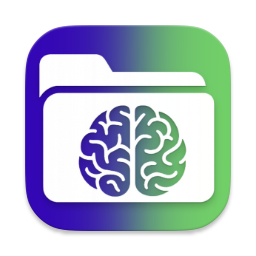
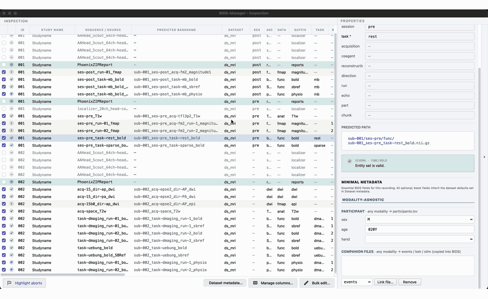
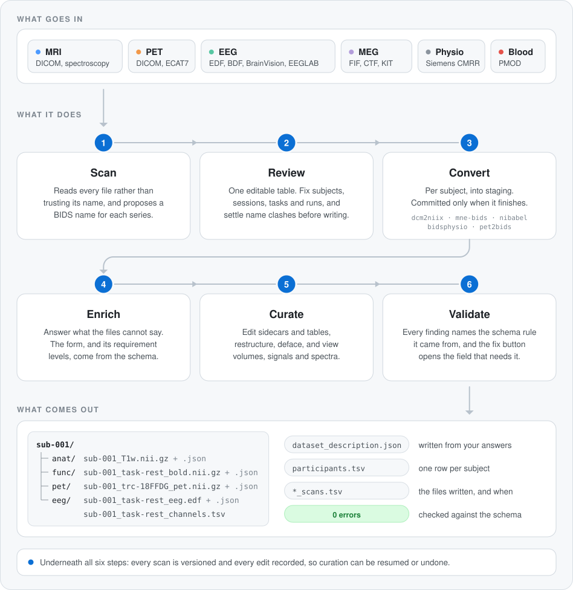
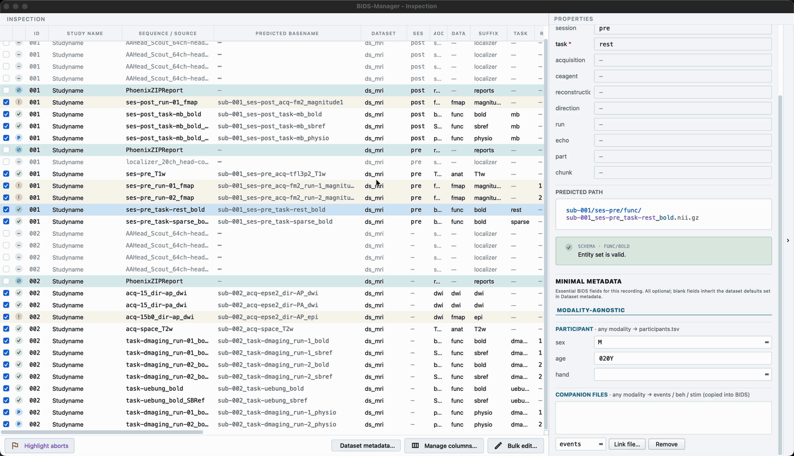
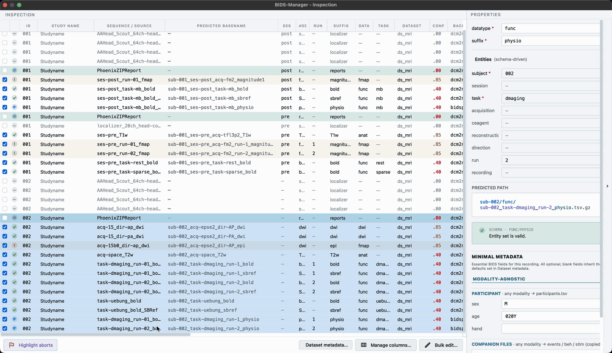
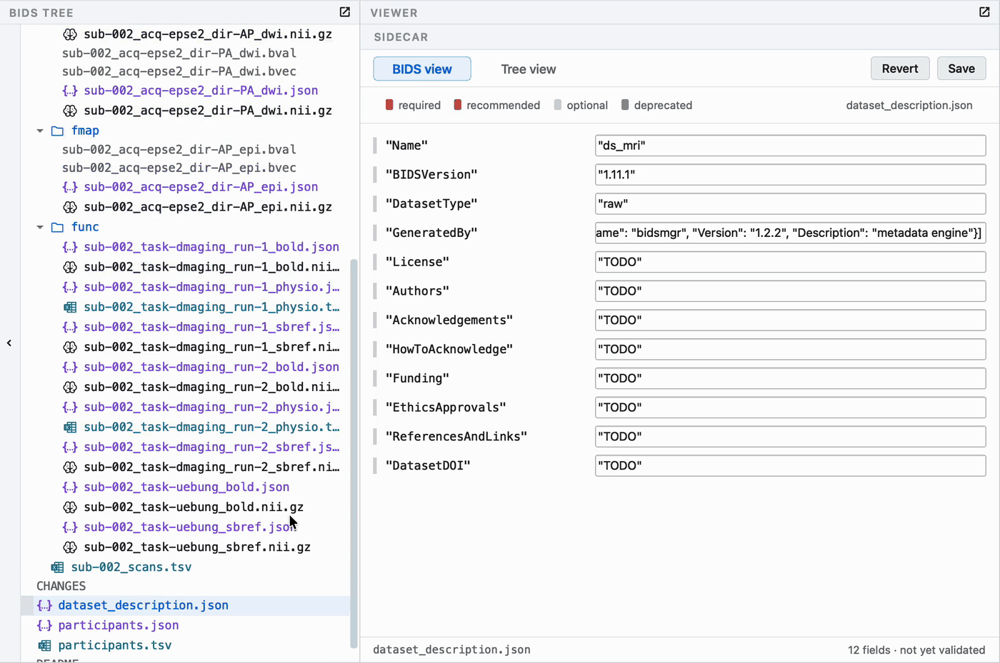
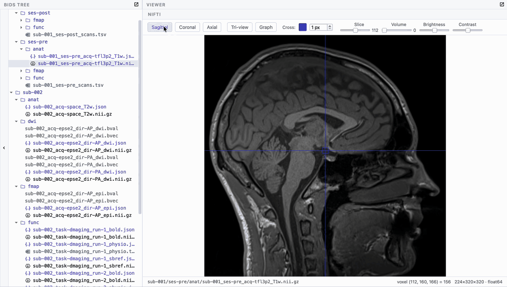
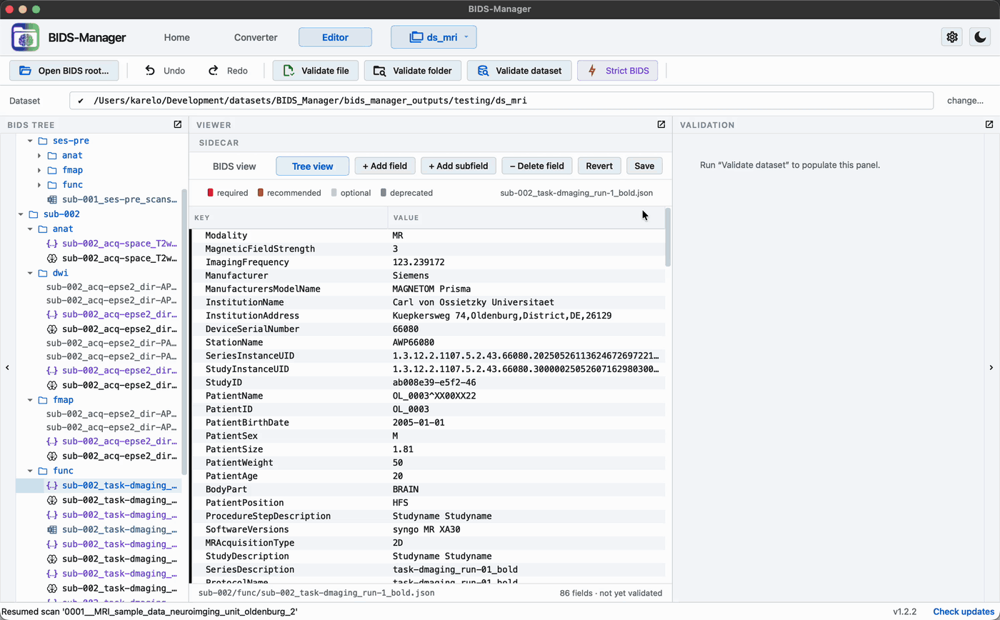

<h1 align="center">
  <br>
  
  <br>
  BIDS Manager
  <br>
</h1>

<h3 align="center">Making raw-to-BIDS less painful.</h3>

<p align="center">
  <a href="https://pypi.org/project/bids-manager/"></a>
  <a href="https://pypi.org/project/bids-manager/"></a>
  <a href="LICENSE"></a>
  <a href="https://ancplaboldenburg.github.io/bids_manager_documentation/"></a>
</p>

<p align="center">
  
</p>

## What is BIDS Manager?

BIDS Manager is a desktop application that turns raw MRI, PET, EEG and MEG
recordings, together with MR spectroscopy, PET blood curves and the
physiological traces Siemens CMRR sequences write beside an MRI series, into a
validated BIDS dataset.

It scans your raw data, shows you every conversion decision in a table you can
edit, runs the conversion, and then opens the result for metadata editing,
restructuring, defacing, inspection and validation. One application, no
scripts, no hand-editing JSON.

The thing it is really built around is not the conversion. Converting a DICOM
series is a solved problem, and BIDS Manager uses the same engines everyone else
does: `dcm2niix` for MRI, spectroscopy and PET DICOM, `mne-bids` for
electrophysiology, `nibabel` for ECAT, `bidsphysio` for physio, `pet2bids` for
blood curves and the PET metadata no converter writes, and `niimath` for
removing faces. What it adds is everything around them:
seeing what you have before anything is written, saying what the files cannot
say for themselves, and being told what is wrong in terms of the standard rather
than a stack trace.

## Get started

The quickest route is the one-click bootstrap installer for macOS, Linux and
Windows. It bundles a portable Python with every dependency and registers a
native desktop launcher, so no existing Python install is required. The
[install guide][install] walks through it.

With Python already set up, `pip install bids-manager` works too.

Launch the interface with `bidsmgr`. Prefer the command line? Nine verbs cover
the whole pipeline:

```
bidsmgr-create     scaffold a dataset and its project
bidsmgr-adopt      bring a dataset converted elsewhere under management
bidsmgr-scan       walk a raw tree and build the inventory
bidsmgr-rebuild    rebuild BIDS names from edited entities
bidsmgr-convert    convert, routing each row to the right engine
bidsmgr-metadata   dataset_description, participants, phenotype
bidsmgr-deface     remove faces, or keep only the brain as a derivative
bidsmgr-validate   validate, with a report you can hand to a colleague
bidsmgr-project    list a project's saved scan versions
```

The [documentation][docs] has the full GUI walkthrough, a reference for every
flag, and a tutorial per modality with a sample dataset you can download and
work through.

[docs]:    https://ancplaboldenburg.github.io/bids_manager_documentation/
[install]: https://ancplaboldenburg.github.io/bids_manager_documentation/installation.html

## The workflow

<p align="center">
  <picture>
    <source media="(prefers-color-scheme: dark)" srcset="docs/workflow-dark.svg">
    
  </picture>
</p>

The features below follow those steps.

## Features

### 1. See what you have, before anything is written

Point the application at a folder of DICOM, EEG, MEG or PET recordings, or all
of them at once. It walks the tree, works out what each series is, and shows the
proposed BIDS name for every one in a table you can sort, filter and bulk-edit.

Formats are recognised by reading the file, not by its extension, so a Philips
export whose filename is a bare identifier still converts and a renamed ECAT is
still an ECAT. Spectroscopy is recognised from the DICOM header in the same way,
so it lands in `mrs/` even when its sequence name looks functional. Anything it
sets aside says why: a scanner report with no image data in it, a localiser, a
series it cannot classify.

<p align="center">
  
</p>

### 2. Convert with confidence

Change any cell before you commit. Subjects, sessions, tasks, runs: the BIDS
filename updates as you type, so what you see is what will be written.

Bulk edit works row by row and asks the standard about each one. Select the
whole study and ask for the acquisition label to go, and it comes off every row
that has one and may lose it, while a `_bold` keeps its `task` because the
standard requires one. The dialog tells you how many rows that is before you
apply it.

Two recordings that would land on the same filename are caught before anything
is written. Genuine repeats are given a `run` number where the standard allows
one; where it does not, both are shown in red and the conversion refuses to
start rather than write one file over another.

Conversion runs per subject into a staging folder and is committed only when
that subject finishes, so a failure never leaves a half-converted tree.

<p align="center">
  
</p>

### 3. Say what the files cannot say

Some things are simply not in the data. An EEG file has nowhere to record its
reference or its ground. A PET scanner records how it reconstructed an image but
not how much tracer went into the person, in what form, or when.

The metadata form is generated from the BIDS schema, so it asks exactly what the
standard declares for each kind of file, at its real requirement level, with the
standard's own description on hover. Answer once for the study, override for the
one recording that differs. What the conversion already worked out is folded
away, so you are only asked what nobody could answer for you.

PET dose and tracer details can come from the lab's own spreadsheet or from a
JSON file written for pet2bids, and what follows from them is derived rather
than asked for: `TimeZero` from the series time, specific radioactivity from
dose and mass. Nothing is guessed, either. A power-line frequency nobody stated
is written as `n/a`, not as 50: 50 Hz is right in Europe and wrong across most
of the Americas, and nothing in the file would say it had been assumed.

<p align="center">
  
</p>

### 4. Curate the dataset you converted

Every sidecar opens as a schema-aware form and every table as a spreadsheet, so
correcting a converted dataset does not mean editing JSON by hand. Edits are
undoable, and validation can be re-run against them without leaving the window.

The shape of the dataset can change too. Add an entity a recording should have
had or remove one it never needed, move recordings into a session or back out
of one, rename any entity value including a subject, and delete recordings,
datatypes or whole sessions. Only what the standard permits for each file is
offered. Everything that names the files being moved or deleted goes with
them: the `*_scans.tsv` rows, `IntendedFor` and the other fields that point at
a file, `TaskName`, the participants and sessions tables. Each change is
previewed as subject, session, datatype and file, the way the dataset is laid
out, then applied as one step and undone as one step.

Some mistakes are valid BIDS and still wrong, so no validator reports them.
**Check coherence** looks for them: a scans row naming a file that is gone, a
participants row for a subject that was deleted, a run index written at two
widths, one value spelled two ways, an `IntendedFor` that disagrees with the
acquisition times. **References** draws every pointer in the dataset in both
directions, which is how you find out whether a run has a fieldmap at all.
**Find and replace a value** and **Index widths** make one correction across
the whole dataset, a subject or a session.

### 5. Look at the data, not just its names

Images open one plane at a time, as three planes sharing a crosshair, or in a
GPU renderer with clipping, lighting and colour-FA. A 4-D run gains a
time-series graph, and on PET its axis is real seconds taken from the frame
times, because PET frames are not evenly spaced and a frame index flattens the
part worth looking at. **Compare images** puts any two side by side and drives
them as one: raw against preprocessed, one echo against another, a derivative
against its source, even at different resolutions.

EEG and MEG open as an interactive signal viewer with channel filtering,
per-segment filtering, an in-application power spectrum and events overlaid from
the `events.tsv` beside them. Physiological recordings open in the same viewer,
and **All of this run** puts a run's cardiac, respiratory and trigger files on
one time axis, each at its own start time, which is the only way to see whether
the trigger lines up with the belt.

MR spectroscopy opens as a spectrum rather than as slices, with labelled
metabolite positions, the chemical shift axis the right way round, line
broadening, phasing, and the free induction decay on a second page.

<p align="center">
  
</p>

### 6. Take out what identifies a person

A head scan contains a face, and a face can be rendered from one. Tick
**Deface** in Settings and every conversion removes it from anatomical and PET
images before the subject is written, so the identifiable image never enters
the dataset. Or deface afterwards, on the whole dataset or a selection, from the
Editor or with `bidsmgr-deface`. The original is kept aside so the face can be
put back, and a before-and-after viewer drives the two images as one, so you can
confirm that the face went and the brain did not.

Skull stripping writes its result to `derivatives/`, with the
`dataset_description.json` that makes that folder a derivative dataset, and
leaves the raw scan exactly as it was.

The participant's name, identifier, date of birth, age, sex, height and weight,
the accession number and the names of the staff involved are removed from every
sidecar as the last step of a conversion, and from the NIfTI-MRS header, where
spectroscopy carries its metadata and no sidecar pass reaches. The UIDs stay:
they trace an image back to its series and identify nobody.

### 7. Be told what is wrong, and where the rule came from

Validation is part of the same application, reads the same BIDS schema the
metadata form was built from, and runs on a dataset of any modality at once.

Every finding names the schema rule it comes from, so you can check the claim
rather than take it on trust, and carries the standard's suggested fix. The fix
button takes you to the field or the cell that needs the answer, not merely to
the file.

It also reports things most tools miss, because they are invisible one file at a
time: a perfectly named file sitting in a folder that is not a datatype, an
entity the standard does not allow for that kind of file, a sidecar left behind
next to no data file at all.

<p align="center">
  
</p>

### 8. Provenance built in

Every edit is recorded in the project, and every scan is kept as a version. Undo
a decision taken in a session weeks ago, or reopen last month's scan and convert
it again against the same answers. Curation is resumable rather than something
you redo from the raw files each time.

A dataset converted by some other tool can be adopted, from the Editor's
**Track changes** or with `bidsmgr-adopt`, so the edits you make to it are
recorded and reversible in the same way. Adopting writes nothing outside
`.bidsmgr/`, so the dataset validates exactly as it did before.

## Modalities

| | Read from | Converted by |
|---|---|---|
| **MRI** | DICOM | `dcm2niix` |
| **MR spectroscopy** | DICOM, detected from its header | `dcm2niix`, written as NIfTI-MRS |
| **PET** | DICOM | `dcm2niix` |
| **PET** | ECAT7, detected by its header rather than a `.v` name | `nibabel` |
| **PET blood** | PMOD `.bld` | `pet2bids` |
| **EEG** | EDF, BDF, BrainVision, EEGLAB | `mne-bids` |
| **EEG** | Neuroscan, GDF, EGI and other non-BIDS formats | `mne-bids`, re-encoded to EDF |
| **MEG** | FIF, CTF `.ds`, KIT `.con`/`.sqd` | `mne-bids` |
| **Physio** | Siemens CMRR log, written beside an MRI series | `bidsphysio` (vendored) |

On Windows, the released `dcm2niix` is killed by the operating system on a
spectroscopy series before it writes anything. BIDS Manager carries a Windows
build of the same converter with enough stack and uses it only for a series the
released one dies on in exactly that way, so everything else still converts
with the released build.

## Authors

**Karel López Vilaret** and **Jochem Rieger**, ANCP Lab,
Carl von Ossietzky Universität Oldenburg.

## License

[MIT](LICENSE).

Physio conversion code under `bidsmgr/vendor/bidsphysio/` is derived
from [`bidsphysio`](https://github.com/cbinyu/bidsphysio) by Pablo
Velasco and Chrysa Papadaniil (NYU Center for Brain Imaging), used
under the MIT License. See `bidsmgr/vendor/bidsphysio/LICENSE` and
`bidsmgr/vendor/README.md` for the full attribution and what
changed during vendoring.

The Windows `dcm2niix.exe` under `bidsmgr/vendor/dcm2niix_win/` is a
build of Chris Rorden's
[`dcm2niix`](https://github.com/rordenlab/dcm2niix) with a larger
stack reserve, distributed under its own license, which ships beside
it. Its `PROVENANCE.md` records exactly how it was built and when it
can be removed.

## Citation

```
López Vilaret, K. M. and Rieger, J.
BIDS Manager (v1.4.1). 2026. https://github.com/ANCPLabOldenburg/BIDS-Manager
```

<p align="center">
  <a href="https://ancplaboldenburg.github.io/bids_manager_documentation/">Documentation</a>
  &middot;
  <a href="https://ancplaboldenburg.github.io/bids_manager_documentation/updates.html">What changed</a>
  &middot;
  <a href="https://github.com/ANCPLabOldenburg/BIDS-Manager/issues">Report a bug</a>
  &middot;
  <a href="https://github.com/ANCPLabOldenburg/BIDS-Manager/issues/new">Suggest a feature</a>
</p>
