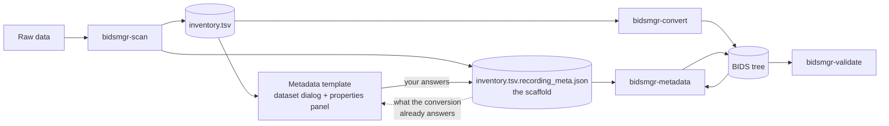
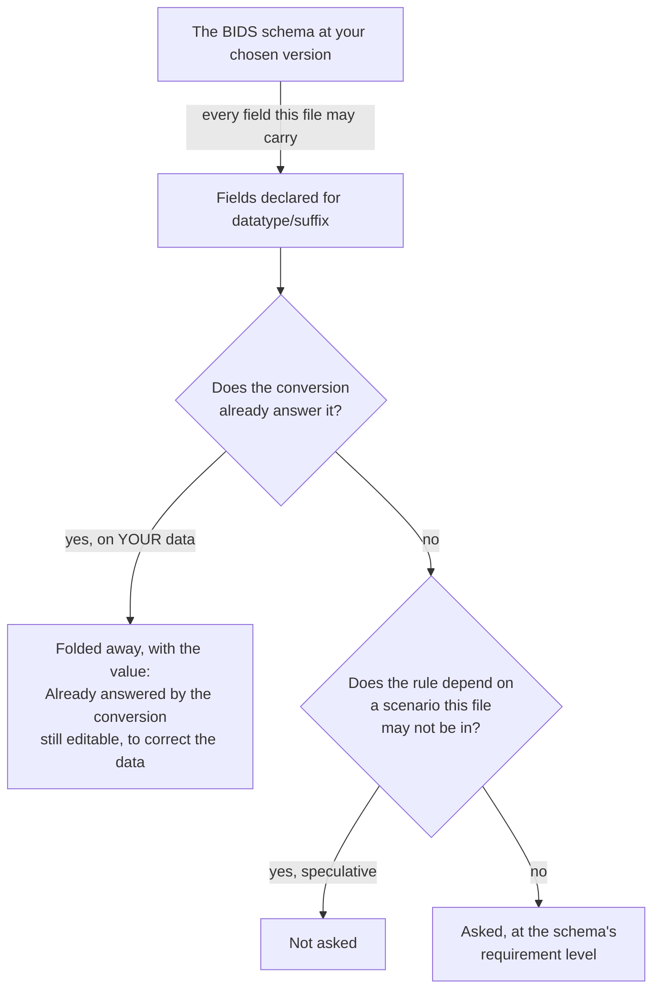
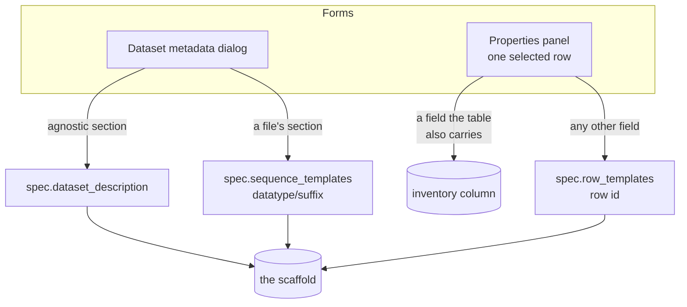
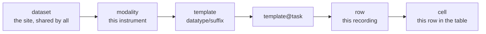
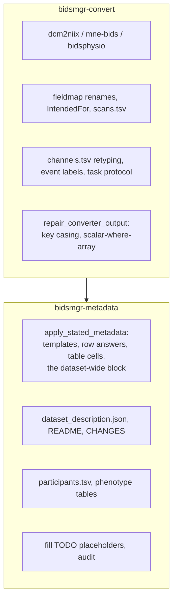

# How metadata flows through BIDS Manager

What the metadata template is, where an answer goes when you type it, and which
step writes it into a file. Read this before changing anything under
`metadata/`, `recording_meta/`, `fixups/` or the two metadata forms.

---

## 1. The one-page version



Three files matter. The **inventory** is the table of what was found. The
**scaffold** beside it holds everything you state that is not a column in that
table. The **BIDS tree** is the output. The template reads the first two and
`bidsmgr-metadata` writes the third.

**Conversion never applies your answers.** `bidsmgr-convert` produces a faithful
conversion and repairs only what the converter itself got wrong.
`bidsmgr-metadata` applies what you stated. The GUI runs metadata immediately
after convert, so from the Run button it is one step.

---

## 2. A section speaks for every file of its kind

This is the thing to understand before anything else. A section headed

> **every `*_bold.json`**  ·  in `func/`  ·  61 files  ·  e.g. `sub-003_task-bernd_bold.json`

is not a form about `sub-003`. It is the statement you are making about all 61
functional runs in the dataset. Answer it once and it is written to every one of
them.

The real filename is shown only as an example of what the section covers. To say
something about ONE recording, select its row in the inspection table and use the
properties panel; that answer overrides this one for that recording alone.

## 3. What the template asks, and why it is not everything



Nothing in that diagram is a list kept in code. The fields, their types, their
vocabularies, their requirement levels and their descriptions all come from the
schema, at the version chosen in **Settings, BIDS version**.

A field the conversion answers is not hidden. It moves into a folded
**Already answered by the conversion** block at the end of the section, showing
the value that will be written, and it stays editable: the converter reads these
out of the data, and when the data is wrong or a legacy file carries nothing,
that block is the only place to correct it. Typing nothing there stores nothing,
so opening it and closing it again changes no file.

### What counts as "the conversion answers it"

Measured on your data, during the scan:

* **DICOM**: a probe conversion runs dcm2niix once per series and reads the
  sidecar it produced.
* **EEG / MEG**: the scanner opens every recording anyway, and asks it the same
  questions mne-bids will ask: channel counts by type, sampling frequency,
  duration, recording type, and the line frequency and manufacturer where the
  header states them.

Two rules keep this honest:

1. **A value of `n/a` is not an answer.** BIDS requires `EEGReference` in every
   EEG sidecar, so mne-bids writes `"n/a"` when it does not know. Counting that
   as answered is what once hid reference, ground and filters from the form.
2. **A field only some files answer is still asked.** Half a dataset answered is
   not answered, and the recordings that lack it need a way to get one.

If a scan could not measure (no probe, no readable recording) a small built-in
list is used as a fallback. It is a fallback, not the authority: it was measured
once, on one tree, with one scanner.

---

## 4. Where an answer goes when you type it



Both forms are rendered by the same code from the same definition
(`gui/widgets/template_form.py`), so a field means the same thing in both. The
dialog states what is true of every `*_eeg.json`; the panel states what is true
of one recording.

A few fields are inventory COLUMNS as well as BIDS fields, because you need them
in the table to sort and bulk-edit: `line_freq` is `PowerLineFrequency`,
`eeg_reference` is `EEGReference`, `eeg_ground` is `EEGGround`. Answering them
in a form writes the column, so the table and the form can never disagree.

**One thing is not from the schema, and it is the only one: `montage`.** It
names an MNE electrode layout to APPLY during conversion so that
`electrodes.tsv` and `coordsystem.json` get written. It is an instruction to the
converter, not a fact about the recording, which is why BIDS has no field for it.

---

## 5. Which answer wins

Every layer is resolved by one function, `recording_meta/chain.py`, weakest
first:



Later beats earlier, and all of it beats what the converter wrote.

Nothing in that chain is a guess. Every layer of it is somebody having typed an
answer into a form, and the form only offers a field when it is worth asking
about. So a value you state replaces what the conversion put there, which is the
whole reason the "already answered by the conversion" block is editable: opening
it and correcting the manufacturer is you saying the header is wrong.

Everything nobody stated is left exactly as the conversion wrote it, which is
almost all of it.

`VARIES` is a fourth state, beside a value, blank, and not-applicable. It says
"this differs per recording, the answer lives further down". It is never itself
written to a sidecar.

---

## 6. Who writes what



The line between them: **convert fixes what the converter wrote; metadata
applies what you stated.** That is why `bidsmgr-convert` alone gives you a
conversion with no opinions in it, and why running `bidsmgr-metadata` is what
puts your template into the files.

---

## 7. The BIDS version

One control, in **Settings, BIDS version**, and one flag, `--schema`, on every
CLI verb. It governs:

| | at 1.8.0 | at 1.11.1 |
|---|---|---|
| fields declared for `anat/T1w` | 64 | 76 |
| questions the template asks for `anat/T1w` | 31 | 36 |
| entities `func/bold` may carry | 10 | 11 |
| datatypes that exist | 12 | 16 |
| `BIDSVersion` stamped into `dataset_description.json` | 1.8.0 | 1.11.1 |
| the version validation judges by | 1.8.0 | 1.11.1 |

Set once, it holds for the whole session: forms, filenames, enrichment and
validation. Several versions ship with BIDS Manager; the default is the newest.

---

## 8. Reading the form

| mark | meaning |
|---|---|
| `*` red | the standard REQUIRES this field for this file |
| `·` amber | the standard RECOMMENDS it |
| unmarked | optional |
| greyed value | inherited, from the layer named in the tooltip |
| **Already answered by the conversion** | folded block: the converter fills these from the data, showing the value; editable, to correct what the data says |
| `N to answer, M required by BIDS` | the section heading: what is still missing, which is the point of the form |
| `differs per recording` | the probed files disagreed; the answer is per recording |

Colour can be turned off in Settings; the marks remain, so the information does
not depend on being able to see colour.

---

## 9. Looking at it

Layout bugs are invisible to a test suite. A pane can pass every assertion about
its widths and still show a field with no box beside it, a column that does not
line up, or a name cut mid-word. All three of those shipped.

```bash
QT_QPA_PLATFORM=offscreen python tools/screenshot_gui.py dark
QT_QPA_PLATFORM=offscreen python tools/screenshot_gui.py light
```

Qt's offscreen platform draws into memory and `QWidget.grab()` returns the
pixels, so this needs no display. It writes the metadata dialog and the
properties panel at several widths, opened and scrolled. Look at them before
believing a layout change worked, and look at both themes: a colour that reads
on the near-black surface can vanish on the light one.

---

## 10. Where the code is

| you want | look in |
|---|---|
| which fields a file may carry | `bidsmgr/schema/` (a thin adapter over `bidsval.schema`) |
| what to ask, arranged as a tree | `bidsmgr/metadata/template_plan.py` |
| what the conversion answers by itself | `bidsmgr/metadata/converter_preview.py`, fallback in `derivable.py` |
| a field becomes a widget | `bidsmgr/gui/widgets/template_form.py` |
| which layer wins | `bidsmgr/recording_meta/chain.py` |
| answers reach the files | `bidsmgr/fixups/sidecar_schema.py`, called by `bidsmgr/metadata/engine.py` |
| which BIDS version is in force | `bidsmgr/schema/loader.py` |
